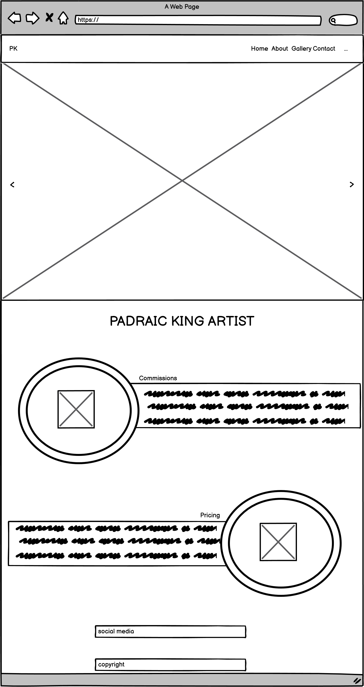

# Padraic King

(Developer: Nuala Gallagher King)

[View deployed site here](https://nules84.github.io/CI_PP1_NewPK/)

## Table of Contents

1. [Project Goals](#project-goals)
    1. [User Goals](#user-goals)
    2. [Site Owner Goals](#site-owner-goals)
2. [Design](#user-experience)
    1. [Target Audience](#target-audience)
    2. [User Requrements and Expectations](#user-requrements-and-expectations)
    3. [User Stories](#user-stories)
3. [Design](#design)
    1. [Design Choices](#design-choices)
    2. [Colour](#colours)
    3. [Fonts](#fonts)
    4. [Structure](#structure)
    5. [Wireframes](#wireframes)
4. [Technologies Used](#technologies-used)
    1. [Languages](#languages)
    2. [Frameworks & Tools](#frameworks-&-tools)
5. [Features](#features)
6. [Testing](#validation)
    1. [HTML Validation](#HTML-validation)
    2. [CSS Validation](#CSS-validation)
    3. [Accessibility](#accessibility)
    4. [Performance](#performance)
    5. [Device testing](#performing-tests-on-various-devices)
    6. [Browser compatibility](#browser-compatability)
    7. [Testing user stories](#testing-user-stories)
8. [Bugs](#Bugs)
9. [Deployment](#deployment)
10. [Credits](#credits)
11. [Acknowledgements](#acknowledgements)

## Project Goals 

A comprehensive website for a traditional portrait artist based in Ireland. The website features a promotional video, testimonials, a gallery of the artist's work, an about page, pricing tables, a clear step-by-step guide to ordering and a contact page. The primary goal of the website is to lead potential customers to making first contact with the artist via the contact page.

An important note on the longer path to buy is that unlike most B2C websites - which are emotion driven to impulse buy and have the fewest number of steps to the point of purchase - ordering a custom piece of art is an expensive and significant purchase, and one that comes with the need for more information than the average B2C purchase. This website tries to address the needs of the customer to find all the information that they need to make a decision to contact the artist, while breaking the information up into small easy to understand sections, and making the steps to the point of contact as clear and easy to follow as possible.

The business goals of this website are:

   * Build brand awareness.
   *  Provide high quality examples of the artist's drawings and paintings.
   *  Drive sales in the form of first contact (via the contact page) that will then lead to a sales call with the artist.
   *  Excellent UX to keep potential clients on site long enough to fill out the contact form.

The customer goals of this website are:

   *  Searching for high quality, bespoke artwork for their home or treasured gift.
   * Clear easy to find pricing.
   *  Intuitive ordering process.

## Design

### Design Choices
The webpage was designed with the feeling a customer might get while dining at the restaurant. It is calm, warm and inviting. 
Some of the imagery on the page has a round shape with a border to resemble food served on a plate.

### Colour
For the colour sheme warm blue tones were chosen to match the images on the page and also the colour theme of the sea side where Padraic grew up. To narrow down the colours I used Adobe Color. After deciding on the colour I tested them on WebAIM to make sure the contrast between them was right.
 

### Fonts
Pinyon script with cursive as fallback was used for the logo to match the sign outside the restaurant. 
 
Montserrat was used for the body and Roboto for headings. Both fonts are considered dyslexia friendly.

### Structure
The page is structured in a well know, recognizable, user friendly, and easy to learn way. Upon arriving to the website the user sees a familiar type of navigation bar with the restaurant logo on the left side and the navigation links to the right. 
The website consists of five separate pages: 
- A homepage with a sections for News and Sunday Meal Offers
- An about page with the About Us and Meet the Chef
- A menu page
- A image gallery with images and video showcasing the general feel of the restaurant
- A contact page with a contact form, a map and information about the bussines section

### Wireframes

Home

About

Gallery

Contact

## Technologies Used

### Languages
- HTML
- CSS

### Frameworks & Tools
- Bootstrap v5.0
- Git
- GitHub
- Gitpod
- Tinypng
- Paint.NET
- Balsamiq
- Google Fonts
- Adobe Color
- Font Awsome
- Favicon.io

## UX

Ideal client
The ideal client for this business is:

   *  English speaking.
   *  Has disposable income.
   *  Can be anywhere in the world.

Visitors to this website are searching for:

   *  An artist to create a commissioned painting to decorate their home.
    And/or a bespoke gift.

This project is the best way to help them achieve these things because:

   *  Most artists' websites have very poor UX.
    Other artists' websites are over complicated and produce information overload quickly.
    This website is:
       *  Easy to navigate.
       *  Steps the client through easy to understand learnable information.
       *  Gives the client the information they need without overloading them.
       *  Guiding them to the goal of the website - to fill out the contact form.

User stories

   *  As a new visitor to the website, I want to easily navigate the site, so I can find what I need efficiently.
   *  As a new visitor to the website, I want view this artist's gallery, and view their work in detail so I can decide if I want to commission their work.
   *  As a new visitor to the website, I want learn more about the artist, so I can feel I connect with him as a person.
   *  As a potential client, I want to know what past clients thought of their artwork and the service they received.
   *  As a potential client, I want to view expected prices for a portrait, so I can decide if it is within my budget to order.
   *  As an interested client, I want to understand the ordering process, so I know what steps to take next.
   *  As an interested client, I want an easy to fill in contact form, so I can make contact with the artist and place my order.
   *  As an interested observer and/or potential client, I want to follow the artist on social media, so I can keep up with her latest news.
   *  As a returning visitor to the website, who has already decided to contact the artist, I want to be able to find out where the artist is geographically so that I might pick up my commission if required.

### Existing Features

- __Navigation Bar__

  - Featured on all four pages, the full responsive navigation bar includes links to the Logo, Home page, Gallery and Sign Up page and is identical in each page to allow for easy navigation.
  - This section will allow the user to easily navigate from page to page across all devices without having to revert back to the previous page via the ‘back’ button. 

- All four pages will also have the bespoke branding "PK" logo along side the title on the browser tab: 

- __The landing page image__

  - The landing includes a photograph with the "Home" button highlighted in a light blue colour to allow the user to see exactly which location this site would be applicable to. 
  - This section introduces the user to Padraic Kings work with an eye catching image to grab their attention

- __Commission and Pricing Section__

  - The Commissions and Pricing section will allow the user to see the commission services provided by the artist and how much it would cost for the service. 
  - By making the buying process simple and explicit as possible, this should encourage the user to consider contacting us for their first commission.

- __The Footer__ 

  - The footer section includes links to the relevant social media sites for Padraic King. The links will open to a new tab to allow easy navigation for the user. 
  - The footer is valuable to the user as it encourages them to keep connected via social media

- __About__

  - The about section gives the user a more personal connection to the artist and his work, featuring the background experience of the artist, his life and image.
  - Having a personal connection with the artist and the background of his work adds value and personal connection to the work. 

  - Below the about information we have a tesimonial which again adds alue by showing testimony from a happy customer. 

  - Below teh testimonial I have included a news section which will be updated at intervals. This section will update the user on the current activities of the artist, adding further value as it gives an impression of current and future project investments.

- __Gallery__

  - The gallery will provide the user with supporting images to see what Padraics work looks like. 
  - This section is valuable to the user as they will be able to easily identify the types of art Padraic can produce and the quality of product they will receive upon purchase. 

- The gallery page also includes a short video of some of Padraics work. This videos is there to keep people on Padraic Kings website longer and engage them with more content. People work with people, and video helps people get to know, like and trust Padraics quality of work. The video helps to keep the audience interested in the product and service.

- __The Contact Page__

  - This page will allow the user to get in contact with Padraic and to commence ordering their first commission visa a form submission. The user will be asked to submit their full name and email address. Upon submitting the form we will be able to compile a useful mailing list as a marketing tool to contact our clients in future with new services and products.

I have included a google map of the Artists geographic location, should clients in the area wish to know the locality of the studio. I have purposefully made the artists specific address and location vague, as the artist has requested that his personal details and home address remain anonymous. 

### Features Left to Implement

In future, I would like to include:
- A downward arrow over the bottom centre of the Hero Image carousel to help leed the users scroll toward the content which continues further down the page. 
- An Archive Tab for Sold and Archived paintings.
- A page for print sales.

## Testing 

### Validator Testing 

The W3C Markup Validation Service was used to validate the HTML of the website. All pages pass with no errors no warnings to show.

Home

About

Gallery

Contact

- CSS

### Performance 
Google Lighthouse in Google Chrome Developer Tools was used to test the performance of the website. 

Home

About

Menu

Gallery

Contact

### Testing user stories

1. As a new visitor to the website, I want to easily navigate the site, so I can find what I need efficiently.

| **Feature** | **Action** | **Expected Result** | **Actual Result** |
|-------------|------------|---------------------|-------------------|
| Nav bar | Navigate to the nav bar menu or hamburger menu on smaller screen| 4 options available for user Home, About, Gallery and  | Works as expected |
| Footer - contact information section | On any page scroll down to the footer | Find links to social media | Works as expected |

Screenshots

2. As a new visitor to the website, I want view this artist's gallery, and view their work in detail so I can decide if I want to commission their work.

| **Feature** | **Action** | **Expected Result** | **Actual Result** |
|-------------|------------|---------------------|-------------------|
| Gallery | Navigate to the Gallery page | See various examples of completed work on page | Works as expected |

Screenshots

3. As a new visitor to the website, I want learn more about the artist, so I can feel I connect with him as a person.

| **Feature** | **Action** | **Expected Result** | **Actual Result** |
|-------------|------------|---------------------|-------------------|
| About | Navigate to the About page and locate the About the Artist section | Find description of the artist| Works as expected | 

Screenshots

4. As a potential client, I want to know what past clients thought of their artwork and the service they received.

| **Feature** | **Action** | **Expected Result** | **Actual Result** |
|-------------|------------|---------------------|-------------------|
| Tesimonial | Navigate to the About page | Find testimonial of previous client | Works as expected |

Screenshots

5. As a potential client, I want to view expected prices for a portrait, so I can decide if it is within my budget to order.

| **Feature** | **Action** | **Expected Result** | **Actual Result** |
|-------------|------------|---------------------|-------------------|
| Home | On home page scroll down to pricing section | Find the pricing expected as per square inch | Works as expected |

Screenshots

6. As an interested client, I want to understand the ordering process, so I know what steps to take next.

| **Feature** | **Action** | **Expected Result** | **Actual Result** |
|-------------|------------|---------------------|-------------------|
| Home | On home page scroll down to commissions section | See instructions on how to complete the commission process | Works as expected |

Screenshots

7. As an interested client, I want an easy to fill in contact form, so I can make contact with the artist and place my order.

| **Feature** | **Action** | **Expected Result** | **Actual Result** |
|-------------|------------|---------------------|-------------------|
| Contact | Navigate to the Contact page through the nav bar | filled out contact form | Works as expected |

Screenshots

8. As an interested observer and/or potential client, I want to follow the artist on social media, so I can keep up with her latest news.

| **Feature** | **Action** | **Expected Result** | **Actual Result** |
|-------------|------------|---------------------|-------------------|
| Footer| Navigate to the footer on all pages | click links that lead to social media sites | Works as expected |

Screenshots

9. As a returning visitor to the website, who has already decided to contact the artist, I want to be able to find out where the artist is geographically so that I might pick up my commission if required.

| **Feature** | **Action** | **Expected Result** | **Actual Result** |
|-------------|------------|---------------------|-------------------|
| Contact| Navigate to the Contact Page and locate the google map of artists geographical location| view and scroll google map for geographic location| Works as expectd |

Screenshots

| **Bug** | **Fix** |
| ----------- | ----------- |
| Overflow appears when viewed on smaller devices | applying the overflow-x:hidden to the wrapper instead of the <body> or <html> fixed the issue |
| Navbar divides into two rows on xs screen size | Add a media query to remove the right margin of the logo in the navbar on xs screen |
| Email overflows on xs screen size | Add a media query that makes the divs spread to 100% width on xs sreens to froce the content onto a seperate line |
| When viewed on tablets, the contact page has whitespace after the footer | Set min-height for body to 100vh |

### Performing tests on various devices 
The website was tested on the following devices:
- Lenovo Yoga 2 Pro (both in pc and tablet mode)
- Honor 20 pro
- Xiaomi Redmi Note 7
  
### Unfixed Bugs

You will need to mention unfixed bugs and why they were not fixed. This section should include shortcomings of the frameworks or technologies used. Although time can be a big variable to consider, paucity of time and difficulty understanding implementation is not a valid reason to leave bugs unfixed. 

## Deployment

- The site was deployed to GitHub pages. The steps to deploy are as follows: 
  - In the GitHub repository, navigate to the Settings tab 
  - From the source section drop-down menu, select the Master Branch
  - Once the master branch has been selected, the page will be automatically refreshed with a detailed ribbon display to indicate the successful deployment. 

## Credits

### Media

-All images for the website are owned by the artist and website author, therefore copyrights belong to the site owner.
-The Video in the Gallery page was created using Vimeo video editor and all images used belong to the artist and site owner.

### Acknowledgements

- I received inspiration for this project from my own experience and from the following websites:
-https://4n4ru.github.io/CI_MS1_BodelschwingherHof/ by Ana Runje
-https://ajgreaves.github.io/portrait-artist/ by AJ Greaves
-https://mattbcoding.github.io/leinster-trophy/index.html by Matt Bodden

- My mentor Mo Shami for his expert guidance and teaching. Mo has guided me towards attempting bootstrap in order to create a better user experience and responsiveness in the website.

### Content 

- The text for the website was created by the website author.
- The icons in the footer were taken from [Font Awesome](https://fontawesome.com/)
- The icon in the tab were also taken from {Favicon](https://favicon.io/)
